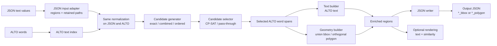
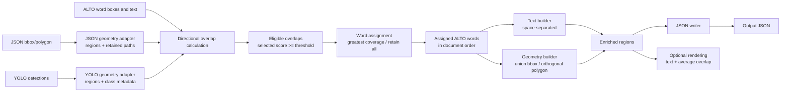

# Text geometry aligner

This package aligns structured input with word-level ALTO OCR in either
direction:

- `TextAligner` matches text from JSON and adds geometry derived from ALTO.
- `GeometryAligner` matches JSON or YOLO geometry and adds text from ALTO.

The aligner name describes the information used for matching, not the
information it produces. Both directions enrich the same document hierarchy.
Consequently, the **text alignment pipeline contains a geometry builder**,
while the **geometry alignment pipeline contains a text builder**.

It can be used from the command line with directories or from Python with
individual files, explicit file collections, or directories.

## Shared alignment model

All input adapters create the same mutable hierarchy:

```text
AlignmentDocument
└── AlignmentPage
    └── AlignmentRegion
        └── AlignmentWord
```

The hierarchy is available before and after matching. Input fields are kept
separate from ALTO-derived fields:

- `AlignmentDocument` holds `input_path`, `alto_path`, and all pages.
- `AlignmentPage` holds its input and ALTO file paths, `alto_page_id`,
  `alto_width`, `alto_height`, and its regions.
- `AlignmentRegion` holds `input_text`, `input_text_normalized`,
  `input_geometry`, the selected text-alignment candidate, `alto_text`,
  `alto_text_normalized`, `alto_geometry`, assigned `words`, JSON paths, and
  optional YOLO category metadata.
- `AlignmentWord` records the selected ALTO word, its normalized comparison
  text, bbox, ALTO indexes, element ID, directional coverage values, and the
  overlap score used for matching.

Fields produced by matching are `None` before matching and remain `None` when
no match is found. JSON pages additionally retain a private working copy in
`json_source_data` so their original arbitrary nesting can be reconstructed
without reading the file again. YOLO pages set `json_source_data` to `None`
because their output JSON is constructed from the regions.

## Installation

Install the package in editable mode from this repository:

```bash
python -m pip install -e .
```

The dependency roles are:

| Dependency | Used for |
| --- | --- |
| Levenshtein | Fuzzy and ordered text alignment |
| OR-Tools | Global CP-SAT candidate selection |
| Pillow | Optional alignment rendering |
| Shapely | Polygon-to-word overlap; bbox overlap also has a dependency-free implementation |

ALTO XML and JSON are read with the Python standard library.

## The two directions

### Text alignment: text in, geometry out

`TextAligner` recursively extracts JSON scalar values, compares them with ALTO
text, chooses compatible matches, and builds geometry around the selected ALTO
words.



The geometry builder is the final step because text matching identifies ALTO
words but does not itself define how their output geometry should be
represented.

Available geometry builders:

- `UnionBoundingBoxGeometryBuilder` returns one bounding box enclosing all
  matched word boxes.
- `OrthogonalPolygonGeometryBuilder` groups matched words by ALTO line and
  creates a closed, axis-aligned polygon that closely covers the words.

For example:

```json
{
  "title": "ROKY ZA STOLETÍ",
  "publisher": [
    "ŠOLC a ŠIMÁČEK",
    "společnost s r. o. v Praze."
  ]
}
```

With bbox output, the parallel result has the same list shape:

```json
{
  "title": "ROKY ZA STOLETÍ",
  "publisher": [
    "ŠOLC a ŠIMÁČEK",
    "společnost s r. o. v Praze."
  ],
  "title_bbox": {
    "x": 108,
    "y": 442,
    "width": 1262,
    "height": 168
  },
  "publisher_bbox": [
    {
      "x": 509,
      "y": 2257,
      "width": 478,
      "height": 52
    },
    {
      "x": 504,
      "y": 2307,
      "width": 486,
      "height": 54
    }
  ]
}
```

An unmatched value receives `null` geometry. String, integer, and float values
are alignable; booleans and existing geometry keys are ignored. Nested
dictionaries and lists are retained through their JSON paths. Scalar list
values must ultimately be owned by a dictionary key so that a parallel
geometry key can be created.

### Geometry alignment: geometry in, text out

`GeometryAligner` creates regions from suffixed JSON geometry or absolute
YOLO detections, measures how much of each ALTO word they cover, resolves
competing regions, and enriches the regions with ALTO text and geometry.



The text builder is the final step because geometry matching identifies the
covered ALTO words but does not define how their text should be reconstructed.
The current `SpaceSeparatedTextBuilder` joins words in ALTO document order
using one space.

For example:

```json
{
  "title_bbox": {
    "x": 108,
    "y": 442,
    "width": 1262,
    "height": 168
  },
  "publisher_bbox": [
    {
      "x": 509,
      "y": 2257,
      "width": 478,
      "height": 52
    },
    {
      "x": 504,
      "y": 2307,
      "width": 486,
      "height": 54
    }
  ]
}
```

Can produce:

```json
{
  "title": "ROKY ZA STOLETÍ",
  "title_bbox": {
    "x": 108,
    "y": 442,
    "width": 1262,
    "height": 168
  },
  "publisher": [
    "ŠOLC a ŠIMÁČEK",
    "společnost s r. o. v Praze."
  ],
  "publisher_bbox": [
    {
      "x": 509,
      "y": 2257,
      "width": 478,
      "height": 52
    },
    {
      "x": 504,
      "y": 2307,
      "width": 486,
      "height": 54
    }
  ]
}
```

The JSON root must be an object. Bboxes and polygons may occur at any nested
dictionary or list depth. Existing destination values are skipped before
overlap calculation unless `--overwrite-existing-text` is enabled. A processed
geometry with no eligible ALTO words produces `null`.

### YOLO geometry input

YOLO input uses one detection per line:

```text
<class_id> <center_x> <center_y> <width> <height> <confidence> <class_name>
```

Coordinates are absolute values in the original image/ALTO coordinate system,
not normalized fractions. The adapter converts center-based coordinates to the
package's top-left `BoundingBox`. `class_id`, `class_name`, and confidence are
retained in each `AlignmentRegion`; ID/name mappings must be consistent within
and across pages.

YOLO files may have any extension or no extension. Pairing removes one final
suffix when present, so `page.full.labels` pairs with `page.full.xml`;
extensionless `page` pairs with `page.xml`.

Because YOLO has no source JSON structure, output is grouped by class name.
Repeated detections remain parallel lists:

```json
{
  "PageNumber": ["12", null],
  "PageNumber_bbox": [
    {"x": 10, "y": 20, "width": 30, "height": 10},
    {"x": 10, "y": 180, "width": 30, "height": 10}
  ]
}
```

## Geometry representations

A bbox is an object in ALTO coordinates:

```json
{
  "x": 100,
  "y": 200,
  "width": 300,
  "height": 50
}
```

A polygon is a list of `[x, y]` points. It must contain at least three vertices
and be closed by repeating the first point:

```json
[
  [100, 200],
  [400, 200],
  [400, 250],
  [100, 250],
  [100, 200]
]
```

The default suffix is `_bbox`. Text alignment automatically uses `_polygon`
when polygon output is selected, unless `--geometry-suffix` overrides it.
Geometry alignment detects whichever suffix is supplied through
`--geometry-suffix`; it can parse both bbox and polygon values beneath that
suffix.

Geometry alignment calculates coverage in both directions:

```text
word coverage = intersection area / ALTO word area
input geometry coverage = intersection area / input geometry area
```

The default `bidirectional-containment` strategy uses the greater of these two
values. It therefore accepts both a word contained by a larger region and a
tight detector region contained by a larger OCR word. The optional
`word-coverage` strategy uses only the first value. A threshold of `1`
requires full containment in at least one selected direction, while `0`
accepts any positive intersection.

With the default `greatest-coverage` assignment, a word belongs only to the
eligible region with the greatest overlap score. Equal scores prefer greater
word coverage, then greater input-geometry coverage, then stable input-region
order. `all-over-threshold` retains the word for every eligible region.

## Command-line usage

Both commands process top-level files in the supplied directories and write
one JSON result per matched page. Output directories are created
automatically.

### Text alignment

```bash
python -m text_geometry_aligner.text_aligner \
  --alto-dir data/alto \
  --input-dir data/json \
  --json-output-dir output/json
```

Example with optional matching and output configuration:

```bash
python -m text_geometry_aligner.text_aligner \
  --alto-dir data/alto \
  --input-dir data/json \
  --json-output-dir output/json \
  --candidate-generator combined \
  --candidate-selector cp-sat \
  --output-alto-geometry-format polygon \
  --text-normalizer lowercase \
  --text-normalizer strip-diacritics
```

Important options:

| Option | Default | Description |
| --- | --- | --- |
| `--candidate-generator` | `combined` | Use `exact`, exact plus fuzzy (`combined`), or `ordered-alignment` matching |
| `--candidate-selector` | `cp-sat` | Use global `cp-sat` selection or `pass-through` |
| `--output-alto-text-format` | `space-separated` | Format used to build ALTO-derived text |
| `--output-alto-geometry-format` | `bbox` | Build `bbox` or `polygon` ALTO geometry |
| `--geometry-suffix` | output-dependent | Override the generated `_bbox` or `_polygon` suffix |
| `--output-text-source` | `json` | Retain `json` text or use matched `alto` text |
| `--text-normalizer` | none | Add comparison normalization; repeat to compose transformations |
| `--overwrite-existing-geometry` | off | Replace existing geometry destinations |

Available optional text normalizers are `lowercase`, `strip-diacritics`, and
`strip-punctuation`. Unicode normalization and whitespace normalization are
always applied. Repeated `--text-normalizer` arguments stack transformations
in the order supplied. The `ordered-alignment` generator assumes JSON values
are already in correct reading order and is normally paired with
`--candidate-selector pass-through`.

Normalization is visible in the returned alignment document without changing
the original text. `input_text_normalized` is available even for unmatched
regions. Successful matches retain `alto_text_normalized`, the complete
selected candidate, and independently normalized ALTO tokens for inspection.
These inspection fields are not added to exported JSON.

CP-SAT first maximizes match quality, exact-match count, and matched-value
count. If complete solutions remain equal, it prefers candidates whose
`start_word` positions are closer to the beginning of the ALTO document, then
uses candidate IDs as a deterministic final fallback.

Fuzzy acceptance defaults:

| Option | Default |
| --- | --- |
| `--fuzzy-query-length-boundary` | `6` non-whitespace characters |
| `--fuzzy-max-cer-at-or-above-boundary` | `0.20` |
| `--fuzzy-max-edit-distance-below-boundary` | `1` |
| `--fuzzy-max-candidates-per-value` | `5` |

Setting the boundary to `0` applies the CER rule to every query.

### Geometry alignment

With JSON geometry:

```bash
python -m text_geometry_aligner.geometry_aligner \
  --alto-dir data/alto \
  --input-dir data/json \
  --input-format json \
  --json-output-dir output/json
```

With YOLO geometry:

```bash
python -m text_geometry_aligner.geometry_aligner \
  --alto-dir data/alto \
  --input-dir data/yolo \
  --input-format yolo \
  --json-output-dir output/json \
  --minimum-overlap-coverage 0.65 \
  --overlap-strategy bidirectional-containment \
  --word-assignment-strategy greatest-coverage
```

Important options:

| Option | Default | Description |
| --- | --- | --- |
| `--input-format` | `json` | Read `json` or `yolo` geometry |
| `--geometry-suffix` | `_bbox` | Identify geometry keys in JSON input |
| `--minimum-overlap-coverage` | `0.65` | Minimum geometry/word overlap score |
| `--overlap-strategy` | `bidirectional-containment` | Use containment in either direction or `word-coverage` only |
| `--word-assignment-strategy` | `greatest-coverage` | Assign a word to one winner or `all-over-threshold` regions |
| `--output-alto-text-format` | `space-separated` | Format used to build ALTO-derived text |
| `--output-alto-geometry-format` | `bbox` | Build `bbox` or `polygon` ALTO geometry |
| `--output-geometry-source` | `input` | Export `input` or ALTO-derived (`alto`) geometry |
| `--overwrite-existing-text` | off | Replace existing text destinations |

### Rendering and missing files

Either command can render the alignments when both image arguments are
provided:

```bash
--images-dir data/images --render-dir output/rendered
```

Images are paired by filename stem. Text-alignment labels show match
similarity; geometry-alignment labels show average overlap score. Geometry is
scaled from ALTO page coordinates when the ALTO page dimensions differ from
the source image dimensions.

By default, an input without matching ALTO is logged and skipped. Add
`--fail-on-missing-alto` to stop with an error instead.

Use `--help` to see every available option:

```bash
python -m text_geometry_aligner.text_aligner --help
python -m text_geometry_aligner.geometry_aligner --help
```

## Python usage

All path-based methods return an `AlignmentDocument`. JSON output is optional
for `process_files()` and `process_directories()`, so their returned results
can be consumed directly by another Python pipeline.

### Create the aligners

```python
from text_geometry_aligner import (
    CPSATCandidateSelector,
    ExactTextCandidateGenerator,
    GeometryAligner,
    TextAligner,
)

text_aligner = TextAligner(
    candidate_generator=ExactTextCandidateGenerator(),
    candidate_selector=CPSATCandidateSelector(),
)

geometry_aligner = GeometryAligner()
```

### Process one input and ALTO file

`process_file()` processes one pair. Provide `json_output_file` when the
result should also be written as JSON:

```python
text_document = text_aligner.process_file(
    alto_file="data/alto/page_001.xml",
    input_file="data/json/page_001.json",
    json_output_file="output/page_001.json",
)

geometry_document = geometry_aligner.process_file(
    alto_file="data/alto/page_001.xml",
    input_file="data/yolo/page_001.txt",
    input_format="yolo",
)
```

Optional rendering requires both paths:

```python
document = geometry_aligner.process_file(
    alto_file="data/alto/page_001.xml",
    input_file="data/yolo/page_001.txt",
    input_format="yolo",
    image_file="data/images/page_001.jpg",
    render_output_file="output/rendered/page_001.jpg",
)
```

### Process explicit file collections

`process_files()` pairs the supplied paths by `page_key`. The order of
`input_files` determines the order of pages in the returned document; the
ALTO list does not need to use the same order.

```python
document = geometry_aligner.process_files(
    alto_files=[
        "data/alto/page_002.full.xml",
        "data/alto/page_001.full.xml",
    ],
    input_files=[
        "data/yolo/page_001.full.txt",
        "data/yolo/page_002.full.txt",
    ],
    input_format="yolo",
)
```

Provide `json_output_dir` when JSON files should also be written:

```python
document = geometry_aligner.process_files(
    alto_files=[
        "data/alto/page_001.xml",
        "data/alto/page_002.xml",
    ],
    input_files=[
        "data/yolo/page_001.txt",
        "data/yolo/page_002.txt",
    ],
    json_output_dir="output/json",
    input_format="yolo",
)
```

Rendering explicit collections requires both `image_files` and
`render_output_dir`.

### Process directories

`process_directories()` discovers top-level files and uses the same pairing
and processing behavior as `process_files()`:

```python
document = text_aligner.process_directories(
    alto_input_dir="data/alto",
    input_dir="data/json",
    json_output_dir="output/json",
)
```

Geometry alignment with YOLO directories:

```python
document = geometry_aligner.process_directories(
    alto_input_dir="data/alto",
    input_dir="data/yolo",
    input_format="yolo",
)
```

Omit `json_output_dir` to return the aligned document without writing JSON.
For rendering, supply both `images_input_dir` and `render_output_dir`. Set
`fail_on_missing_alto=True` to reject inputs without matching ALTO instead of
skipping them.

### Format adapters in memory

Format readers create `AlignmentPage` objects from either files or in-memory
data. JSON has separate readers because text and geometry inputs require
different extraction rules:

```python
from text_geometry_aligner import (
    JSONGeometryReader,
    JSONTextReader,
    YOLOReader,
)

text_page = JSONTextReader().from_data({"title": "Rome"})
geometry_page = JSONGeometryReader().read("input/page.json")
yolo_page = YOLOReader().from_data(detections, page_key="page")
```

`AlignmentJSONWriter.to_data(page)` returns an in-memory dictionary, while
`AlignmentJSONWriter.write(page, path)` atomically writes the same result to
disk. The aligners expose their configured writer as `json_writer`.

## Package structure and extension points

| Area | Responsibility and primary extension points |
| --- | --- |
| `io_alto` | Read ALTO into the internal word-level representation |
| `io_json` | Read JSON into alignment pages and convert/write enriched pages |
| `io_yolo` | Read absolute YOLO detections into geometry alignment pages |
| `text_matching` | Normalized ALTO text indexing, candidate generation, and candidate selection |
| `geometry_matching` | `GeometryOverlapCalculator` and `GeometryWordAssigner` implementations |
| `geometry_building` | `GeometryBuilder` implementations used directly by both aligners |
| `text_building` | `TextBuilder` implementations used directly by both aligners |
| `normalization.py` | Composable `TextNormalizer` stages applied equally to JSON and ALTO |
| `rendering.py` | Direction-neutral `AlignmentRenderer` implementations |

The abstract interfaces enforce each component contract. Custom components can
be injected into the aligner constructors without changing the orchestration
logic. Both aligners accept `text_builder` and `geometry_builder`. The selected
builders populate `alto_text` and `alto_geometry`, respectively. A custom
geometry builder must return the geometry type selected by
`output_geometry_format`; a custom text builder receives assigned `ALTOWord`
objects in ALTO document order and returns the final string or `None` for an
empty assignment.

`BaseAligner` provides the shared ALTO text/geometry builder configuration and
CLI options, single-file, file-collection, and directory processing, output
writing, filename pairing, category validation, and optional rendering for
both directions. Input adapters and writers are intentionally separate from
the matching algorithms so additional formats can reuse the same hierarchy.
