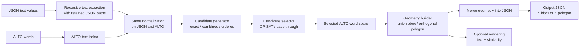
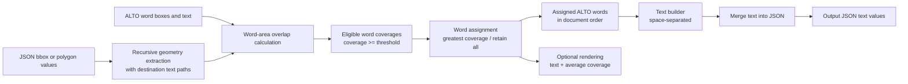

# Text geometry aligner

This package aligns JSON metadata with word-level ALTO OCR in either
direction:

- `TextAligner` finds JSON text in ALTO and writes the geometry of the matched
  ALTO words.
- `GeometryAligner` finds ALTO words covered by JSON geometry and writes their
  text.

The aligner name describes the information used for matching, not the
information it produces. Consequently, the **text alignment pipeline contains
a geometry builder**, while the **geometry alignment pipeline contains a text
builder**.

## Installation

Install the dependencies needed by this package from the repository root:

```bash
python -m pip install \
  -r requirements.txt
```

The dependency roles are:

| Dependency | Used for |
| --- | --- |
| Levenshtein | Fuzzy and ordered text alignment |
| OR-Tools | Global CP-SAT candidate selection |
| Pillow | Optional alignment rendering |
| Shapely | Polygon-to-word overlap; bbox overlap also has a dependency-free implementation |

ALTO XML and JSON are read with the Python standard library.

## The two directions

### Text alignment: text in, geometry out

`TextAligner` recursively extracts JSON scalar values, compares them with ALTO
text, chooses compatible matches, and builds geometry around the selected ALTO
words.



The geometry builder is the final step because text matching identifies ALTO
words but does not itself define how their output geometry should be
represented.

Available geometry builders:

- `UnionBoundingBoxGeometryBuilder` returns one bounding box enclosing all
  matched word boxes.
- `OrthogonalPolygonGeometryBuilder` groups matched words by ALTO line and
  creates a closed, axis-aligned polygon that closely covers the words.

For example:

```json
{
  "title": "ROKY ZA STOLETÍ",
  "publisher": [
    "ŠOLC a ŠIMÁČEK",
    "společnost s r. o. v Praze."
  ]
}
```

With bbox output, the parallel result has the same list shape:

```json
{
  "title": "ROKY ZA STOLETÍ",
  "publisher": [
    "ŠOLC a ŠIMÁČEK",
    "společnost s r. o. v Praze."
  ],
  "title_bbox": {
    "x": 108,
    "y": 442,
    "width": 1262,
    "height": 168
  },
  "publisher_bbox": [
    {
      "x": 509,
      "y": 2257,
      "width": 478,
      "height": 52
    },
    {
      "x": 504,
      "y": 2307,
      "width": 486,
      "height": 54
    }
  ]
}
```

An unmatched value receives `null` geometry. String, integer, and float values
are alignable; booleans and existing geometry keys are ignored. Nested
dictionaries and lists are retained through their JSON paths. Scalar list
values must ultimately be owned by a dictionary key so that a parallel
geometry key can be created.

### Geometry alignment: geometry in, text out

`GeometryAligner` recursively extracts suffixed JSON geometries, measures how
much of each ALTO word they cover, resolves competing regions, and builds text
from the assigned words.



The text builder is the final step because geometry matching identifies the
covered ALTO words but does not define how their text should be reconstructed.
The current `SpaceSeparatedTextBuilder` joins words in ALTO document order
using one space.

For example:

```json
{
  "title_bbox": {
    "x": 108,
    "y": 442,
    "width": 1262,
    "height": 168
  },
  "publisher_bbox": [
    {
      "x": 509,
      "y": 2257,
      "width": 478,
      "height": 52
    },
    {
      "x": 504,
      "y": 2307,
      "width": 486,
      "height": 54
    }
  ]
}
```

Can produce:

```json
{
  "title": "ROKY ZA STOLETÍ",
  "title_bbox": {
    "x": 108,
    "y": 442,
    "width": 1262,
    "height": 168
  },
  "publisher": [
    "ŠOLC a ŠIMÁČEK",
    "společnost s r. o. v Praze."
  ],
  "publisher_bbox": [
    {
      "x": 509,
      "y": 2257,
      "width": 478,
      "height": 52
    },
    {
      "x": 504,
      "y": 2307,
      "width": 486,
      "height": 54
    }
  ]
}
```

The JSON root must be an object. Bboxes and polygons may occur at any nested
dictionary or list depth. Existing destination values are skipped before
overlap calculation unless `--overwrite-existing-text` is enabled. A processed
geometry with no eligible ALTO words produces `null`.

## Geometry representations

A bbox is an object in ALTO coordinates:

```json
{
  "x": 100,
  "y": 200,
  "width": 300,
  "height": 50
}
```

A polygon is a list of `[x, y]` points. It must contain at least three vertices
and be closed by repeating the first point:

```json
[
  [100, 200],
  [400, 200],
  [400, 250],
  [100, 250],
  [100, 200]
]
```

The default suffix is `_bbox`. Text alignment automatically uses `_polygon`
when polygon output is selected, unless `--geometry-suffix` overrides it.
Geometry alignment detects whichever suffix is supplied through
`--geometry-suffix`; it can parse both bbox and polygon values beneath that
suffix.

Word coverage is:

```text
area(JSON geometry ∩ ALTO word bbox) / area(ALTO word bbox)
```

Therefore, a threshold of `1` requires the complete word box to be covered,
while `0` accepts any positive intersection. With the default
`greatest-coverage` assignment, a word belongs to only the eligible region
covering the largest fraction of it. Ties are resolved by stable JSON traversal
order. `all-over-threshold` retains the word for every eligible region.

## Command-line usage

Both commands process top-level JSON files in a directory. Each JSON file is
paired with an ALTO `.xml` file having the same filename stem. Output
directories are created automatically.

### Text alignment CLI

```bash
python -m text_geometry_aligner.text_aligner \
  --alto-dir data/alto \
  --json-input-dir data/json \
  --json-output-dir output/json \
  --candidate-generator combined \
  --candidate-selector cp-sat \
  --output-geometry-format polygon \
  --text-normalizer lowercase \
  --text-normalizer strip-diacritics \
  --text-normalizer strip-punctuation
```

Important text-alignment options:

| Option | Choices/default | Meaning |
| --- | --- | --- |
| `--candidate-generator` | `combined` | `exact`, exact plus bounded fuzzy (`combined`), or `ordered-alignment` |
| `--candidate-selector` | `cp-sat` | Globally select non-overlapping candidates, or use `pass-through` |
| `--output-geometry-format` | `bbox` | Build `bbox` or `polygon` output |
| `--geometry-suffix` | automatic | Defaults to `_bbox` or `_polygon` from the output format |
| `--output-text-source` | `json` | Preserve JSON text or replace matched values with original `alto` text |
| `--text-normalizer` | optional | Normalize both JSON and ALTO comparison texts before alignment; repeat to compose lowercase, diacritic stripping, and punctuation stripping |
| `--preserve-existing-geometry` | off | Skip values already having the selected sibling geometry key |

Unicode NFKC normalization and whitespace collapsing always run. Each
`--text-normalizer` optionally adds a transformation to both the JSON and ALTO
comparison texts before alignment. Repeated arguments stack the transformations
in the order supplied. The `ordered-alignment` generator assumes JSON values
are already in correct reading order and is normally paired with
`--candidate-selector pass-through`.

CP-SAT first maximizes match quality, exact-match count, and matched-value
count. If complete solutions remain equal, it prefers candidates whose
`start_word` positions are closer to the beginning of the ALTO document, then
uses candidate IDs as a deterministic final fallback.

Fuzzy acceptance defaults:

| Option | Default |
| --- | --- |
| `--fuzzy-query-length-boundary` | `6` non-whitespace characters |
| `--fuzzy-max-cer-at-or-above-boundary` | `0.20` |
| `--fuzzy-max-edit-distance-below-boundary` | `1` |
| `--fuzzy-max-candidates-per-value` | `5` |

Setting the boundary to `0` applies the CER rule to every query.

### Geometry alignment CLI

```bash
python -m text_geometry_aligner.geometry_aligner \
  --alto-dir data/alto \
  --json-input-dir data/json \
  --json-output-dir output/json \
  --geometry-suffix _bbox \
  --minimum-word-coverage 0.65 \
  --word-assignment-strategy greatest-coverage \
  --text-builder space-separated
```

Important geometry-alignment options:

| Option | Choices/default | Meaning |
| --- | --- | --- |
| `--geometry-suffix` | `_bbox` | Identify geometry keys and derive destination text keys |
| `--minimum-word-coverage` | `0.65` | Minimum covered fraction of each ALTO word |
| `--word-assignment-strategy` | `greatest-coverage` | Choose one winner or use `all-over-threshold` |
| `--text-builder` | `space-separated` | Construct output text from assigned words |
| `--overwrite-existing-text` | off | Process and replace destinations that already exist |

### Rendering

Add both common rendering arguments to either command:

```bash
--images-dir data/images --render-dir output/rendered
```

Images are paired by filename stem. Text-alignment labels show match
similarity; geometry-alignment labels show average word coverage. Geometry is
scaled from ALTO page coordinates when the ALTO page dimensions differ from
the source image dimensions.

Use `--fail-on-missing-alto` to fail rather than skip JSON files without a
paired ALTO XML file.

## Python API

### Text to geometry

The text aligner receives its candidate generator and selector explicitly:

```python
from text_geometry_aligner import (
    AnchoredFuzzyTextCandidateGenerator,
    CPSATCandidateSelector,
    CompositeCandidateGenerator,
    ExactTextCandidateGenerator,
    FuzzyCandidateConfig,
    TextAligner,
)

candidate_generator = CompositeCandidateGenerator(
    (
        ExactTextCandidateGenerator(),
        AnchoredFuzzyTextCandidateGenerator(FuzzyCandidateConfig()),
    )
)

aligner = TextAligner(
    candidate_generator=candidate_generator,
    candidate_selector=CPSATCandidateSelector(),
    output_geometry_format="polygon",
)
result = aligner.align_files(
    "data/alto/page.xml",
    "data/json/page.json",
    "output/page.json",
)

print(result.matched_count, result.unmatched_count)
```

### Geometry to text

```python
from text_geometry_aligner import GeometryAligner

aligner = GeometryAligner(
    geometry_suffix="_bbox",
    minimum_word_coverage=0.65,
    word_assignment_strategy="greatest-coverage",
)
result = aligner.align_files(
    "data/alto/page.xml",
    "data/json/page.json",
    "output/page.json",
)

print(result.matched_count, result.unmatched_count)
```

For in-memory use, parse or construct an `ALTOPage` and call
`aligner.align_data(alto_page, input_data)`.

## Package structure and extension points

| Area | Responsibility and primary extension points |
| --- | --- |
| `alto_io`, `alto_processing` | Read ALTO and create its normalized text index |
| `json_io`, `json_processing` | Recursively extract retained JSON paths and merge results |
| `text_matching` | `CandidateGenerator` and `CandidateSelector` implementations |
| `geometry_matching` | `GeometryOverlapCalculator` and `GeometryWordAssigner` implementations |
| `geometry_building` | `GeometryBuilder` implementations used by `TextAligner` |
| `text_building` | `TextBuilder` implementations used by `GeometryAligner` |
| `normalization.py` | Composable `TextNormalizer` stages applied equally to JSON and ALTO |
| `rendering.py` | Direction-neutral `AlignmentRenderer` implementations |

The abstract interfaces enforce each component contract. Custom components can
be injected into the aligner constructors without changing the orchestration
logic. A custom geometry builder must return the geometry type selected by
`output_geometry_format`. A custom text builder receives assigned `OCRWord`
objects in ALTO document order and returns the final string or `None` for an
empty assignment.

`BaseAligner` provides the shared file, directory, JSON writing, filename
pairing, and optional rendering workflow for both directions.
